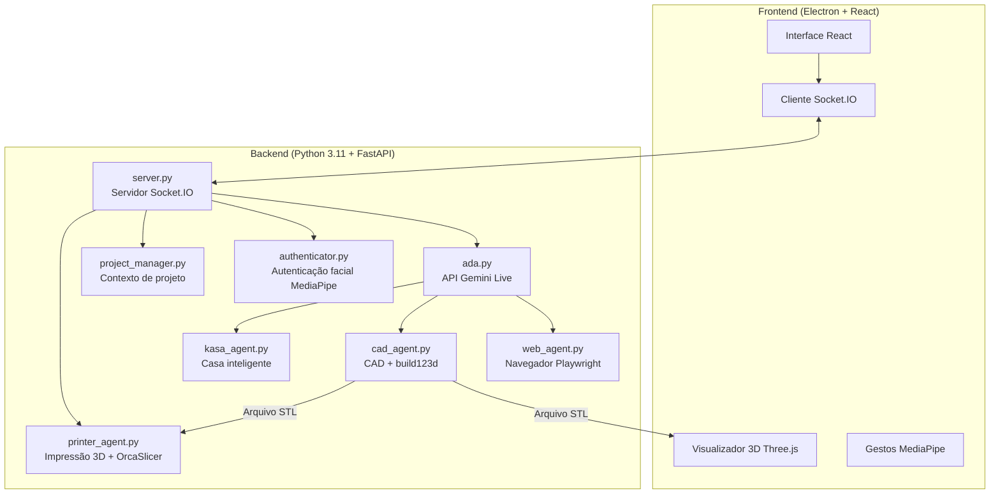

# A.D.A V2 - Assistente Avançado de Design


> **A.D.A** = **A**ssistente **A**vançado de **D**esign

A.D.A V2 é um assistente de IA para uso com voz, texto e visão. Ele combina o áudio nativo do Google Gemini 2.5 com visão computacional, controle por gestos e, opcionalmente, geração de CAD 3D em um aplicativo desktop Electron.

### 📌 Sobre este repositório

**O mérito da criação do projeto é inteiramente de [Nazir Louis](https://github.com/nazirlouis).**  
Este repositório contém uma **tradução e adaptação para português brasileiro** do projeto original [ada_v2](https://github.com/nazirlouis/ada_v2). A autoria, a arquitetura e as ideias originais são dele; aqui apenas foram traduzidos textos, documentação e interface, e feitas pequenas adaptações (por exemplo, opção de desativar CAD e impressão 3D por padrão).

---

## 🌟 Recursos em resumo

| Recurso | Descrição | Tecnologia |
|---------|-----------|------------|
| **🗣️ Voz em tempo real** | Conversa com baixa latência e interrupção | Gemini 2.5 Native Audio |
| **🧊 CAD paramétrico** | Geração de modelos 3D editáveis por voz (opcional) | `build123d` → STL |
| **🖨️ Impressão 3D** | Fatiamento e envio de impressão via rede (opcional) | OrcaSlicer + Moonraker/OctoPrint |
| **🖐️ Interface “Minority Report”** | Janelas controladas por gestos das mãos | MediaPipe Hand Tracking |
| **👁️ Autenticação facial** | Login biométrico local | MediaPipe Face Landmarker |
| **🌐 Agente web** | Automação de navegador | Playwright + Chromium |
| **🏠 Casa inteligente** | Controle por voz de dispositivos TP-Link Kasa | `python-kasa` |
| **📁 Memória de projeto** | Contexto persistente entre sessões | Armazenamento em JSON |

### 🖐️ Controle por gestos

A interface “Minority Report” usa a webcam para detectar gestos:

| Gesto | Ação |
|-------|------|
| 🤏 **Pinça** | Confirmar ação / clicar |
| ✋ **Mão aberta** | Soltar a janela |
| ✊ **Punho fechado** | “Selecionar” e arrastar uma janela |

> **Dica**: Ative a câmera para ver a overlay de rastreamento das mãos.

---

## 🏗️ Visão geral da arquitetura



---

## ⚡ Início rápido (quem já mexe com código)

<details>
<summary>Clique para ver os comandos de configuração</summary>

```bash
# 1. Clonar e entrar na pasta
git clone https://github.com/InnersoftTecnologia/projeto_ada-pt_br.git && cd projeto_ada-pt_br

# 2. Criar ambiente Python (3.11)
conda create -n ada_v2 python=3.11 -y && conda activate ada_v2
# macOS: brew install portaudio
# Linux (ex.: Debian/Ubuntu): sudo apt install portaudio19-dev
pip install -r requirements.txt
playwright install chromium

# 3. Instalar frontend
npm install

# 4. Criar arquivo .env
echo "GEMINI_API_KEY=sua_chave_aqui" > .env

# 5. Rodar
conda activate ada_v2 && npm run dev
```

</details>

---

## 🛠️ Requisitos de instalação

### 🆕 Primeira vez programando? Comece aqui

**Passo 1: Instalar o VS Code**
- Baixe e instale o [VS Code](https://code.visualstudio.com/). É nele que você vai editar código e rodar comandos.

**Passo 2: Instalar o Anaconda/Miniconda**
- Baixe o [Miniconda](https://docs.conda.io/en/latest/miniconda.html).
- Com ele você cria ambientes isolados por projeto.
- **Windows**: Na instalação, marque “Add Anaconda to my PATH” (facilita para iniciantes).

**Passo 3: Instalar o Git**
- **Windows**: [Git for Windows](https://git-scm.com/download/win).
- **Mac**: Abra o Terminal e digite `git`; se pedir para instalar ferramentas de desenvolvimento, aceite.

**Passo 4: Baixar o código**
1. Abra o terminal (ou Prompt de Comando no Windows).
2. Execute:
   ```bash
   git clone https://github.com/InnersoftTecnologia/projeto_ada-pt_br.git
   ```
3. Será criada a pasta do projeto.

**Passo 5: Abrir no VS Code**
1. Abra o VS Code.
2. **Arquivo > Abrir Pasta** e escolha a pasta do projeto.
3. Abra o terminal integrado: `Ctrl + ~` ou **Terminal > Novo Terminal**.

---

### ⚠️ Pré-requisitos técnicos

### 1. Dependências de sistema

**macOS:**
```bash
# Suporte a áudio (PyAudio)
brew install portaudio
```

**Linux (Debian/Ubuntu):**
```bash
sudo apt install portaudio19-dev
# ou: libportaudio2
```

**Windows:**
- Não costuma precisar de dependência extra de sistema.

### 2. Ambiente Python

Crie um ambiente com Python 3.11:

```bash
conda create -n ada_v2 python=3.11
conda activate ada_v2

pip install -r requirements.txt
playwright install chromium
```

### 3. Frontend

É preciso **Node.js 18+** e **npm**. Baixe em [nodejs.org](https://nodejs.org/) se ainda não tiver.

```bash
node --version   # deve ser v18 ou superior
npm install
```

### 4. 🔐 Configuração da autenticação facial

Para usar a Ada com reconhecimento de rosto:

1. Tenha uma foto nítida do seu rosto.
2. Salve como `reference.jpg`.
3. Coloque o arquivo dentro da pasta `backend/`.
4. Em `settings.json` você pode ligar/desligar com `"face_auth_enabled": true/false`.

---

## ⚙️ Configuração (`settings.json`)

O arquivo `settings.json` é criado na primeira execução, dentro de `backend/`. Exemplos de opções:

| Chave | Tipo | Descrição |
| :---- | :--- | :-------- |
| `face_auth_enabled` | `bool` | Se `true`, bloqueia a IA até o rosto ser reconhecido pela câmera. |
| `cad_enabled` | `bool` | Se `false`, desativa CAD paramétrico e oculta o botão na interface. |
| `printer_enabled` | `bool` | Se `false`, desativa impressão 3D e oculta o botão na interface. |
| `tool_permissions` | `obj` | Define se certas ações precisam de confirmação manual. |
| `tool_permissions.generate_cad` | `bool` | Se `true`, exige “Confirmar” na interface antes de gerar CAD. |
| `tool_permissions.run_web_agent` | `bool` | Se `true`, exige confirmação antes de abrir o agente de navegador. |
| `tool_permissions.write_file` | `bool` | **Importante**: exige confirmação antes da IA gravar arquivos em disco. |

---

### 5. 🖨️ Configuração de impressora 3D (opcional)

O A.D.A pode fatiar STL e enviar para a impressora, se a capacidade estiver ativa.

**Hardware suportado:**
- **Klipper/Moonraker** (Creality K1, Voron, etc.)
- **OctoPrint**
- **PrusaLink** (experimental)

**Passo 1: Instalar o slicer**
- Recomendado: [OrcaSlicer](https://github.com/SoftFever/OrcaSlicer). Rode uma vez para criar os perfis.
- O A.D.A tenta detectar o caminho de instalação.

**Passo 2: Conectar a impressora**
- Impressora e computador na mesma rede Wi-Fi.
- Abra a janela de impressora (ícone de impressora) no A.D.A.
- A descoberta é feita via mDNS. Se não achar, use “Adicionar impressora” e informe o IP (ex.: `192.168.1.50`).

---

### 6. 🔑 Chave da API Gemini

A Ada usa a API do Google Gemini para voz e inteligência. Você precisa de uma chave gratuita.

1. Acesse [Google AI Studio](https://aistudio.google.com/app/apikey).
2. Entre com sua conta Google.
3. Clique em **“Create API Key”** e copie a chave.
4. Crie o arquivo `.env` na raiz do projeto (mesmo nível do `README.md`).
5. Coloque uma linha assim:
   ```
   GEMINI_API_KEY=sua_chave_aqui
   ```
6. Substitua `sua_chave_aqui` pela chave copiada.

> **Atenção**: Mantenha a chave em segredo. Não envie o `.env` para o Git.

---

## 🚀 Como rodar o A.D.A V2

Ative o ambiente antes: `conda activate ada_v2`.

### Opção 1: Forma simples (um terminal)

O próprio app inicia o backend.

1. No terminal, na pasta do projeto.
2. `conda activate ada_v2`
3. Rode:
   ```bash
   npm run dev
   ```
4. O backend sobe em segundo plano e a janela do Electron abre quando estiver pronto.

### Opção 2: Modo desenvolvedor (dois terminais)

Útil para ver os logs do Python.

**Terminal 1 (backend):**
```bash
conda activate ada_v2
python backend/server.py
```

**Terminal 2 (frontend):**
```bash
npm run dev
```

---

## ✅ Checklist da primeira execução

1. **Voz**: Diga “Olá, Ada” — ela deve responder em português.
2. **Câmera**: Com autenticação facial ativa, olhe para a câmera para desbloquear.
3. **CAD** (se ativado): Abra a janela de CAD e peça, por exemplo, “Crie um cubo”.
4. **Navegador**: Abra a janela do navegador e peça “Acesse o Google”.
5. **Casa inteligente**: Se tiver dispositivos Kasa, peça para ligar ou desligar luzes.

---

## ▶️ Comandos e ferramentas

### 🗣️ Comandos por voz (em português)
- “Mude o projeto para [Nome]”
- “Crie um novo projeto chamado [Nome]”
- “Acenda a luz do [cômodo]”
- “Deixe a luz [cor]”
- “Pausar áudio” / “Parar áudio”

### 🧊 CAD 3D (se `cad_enabled` estiver ativo)
- **Exemplo**: “Crie um modelo 3D de um parafuso hexagonal.”
- **Iteração**: “Deixe a cabeça mais fina.” (usa o contexto do modelo atual)
- **Arquivos**: Salvos em `projects/[NomeDoProjeto]/output.stl`.

### 🌐 Agente web
- **Exemplo**: “Vá na Amazon e procure um cabo USB-C barato.”
- O agente rola a página, clica e digita sozinho. Evite mexer na janela do navegador enquanto ele trabalha.

### 🖨️ Impressão e fatiamento (se `printer_enabled` estiver ativo)
- **Descoberta**: O A.D.A procura impressoras na rede.
- **Fatiar e imprimir**: Use “Fatiar e imprimir” no modelo 3D gerado.
- **Perfis**: O perfil do OrcaSlicer é escolhido conforme o nome da impressora (ex.: “Creality K1”).

---

## ❓ Problemas comuns

### Câmera não funciona / permissão negada (Mac)
**Sintoma**: Erro de acesso à câmera ou tela preta.

**Solução**:
1. **Ajustes do Sistema > Privacidade e Segurança > Câmera**.
2. Libere acesso para o Terminal, iTerm ou VS Code, conforme o que estiver usando.
3. Reinicie o app após liberar.

---

### Chave `GEMINI_API_KEY` não encontrada
**Sintoma**: O backend encerra com erro de “API key not found”.

**Solução**:
1. O `.env` deve ficar na **raiz do projeto** (não dentro de `backend/`).
2. Formato: `GEMINI_API_KEY=sua_chave` (sem aspas, sem espaços em volta).
3. Reinicie o backend depois de editar o `.env`.

---

### Erro de conexão WebSocket (1011)
**Sintoma**: `ConnectionClosedError: 1011 (internal error)`.

**Solução**:
Geralmente é um problema temporário do lado da API Gemini. Tente conectar de novo (botão de conectar ou “Olá, Ada”). Se continuar, confira a internet e tente mais tarde.

---

## 📸 Como é a interface

*Em breve: screenshots e vídeos de demonstração.*

---

## 📂 Estrutura do projeto

```
projeto_ada-pt_br/
├── backend/                    # Servidor Python e lógica da IA
│   ├── ada.py                  # Integração com a API Gemini Live
│   ├── server.py               # Servidor FastAPI + Socket.IO
│   ├── cad_agent.py            # Orquestrador de geração CAD
│   ├── printer_agent.py        # Descoberta e fatiamento 3D
│   ├── web_agent.py            # Automação de navegador (Playwright)
│   ├── kasa_agent.py           # Controle de dispositivos TP-Link Kasa
│   ├── authenticator.py        # Autenticação facial (MediaPipe)
│   ├── project_manager.py      # Contexto de projetos
│   ├── tools.py                # Definição de ferramentas para o Gemini
│   └── reference.jpg           # Sua foto para autenticação (adicione!)
├── src/                        # Frontend React
│   ├── App.jsx                 # Componente principal
│   ├── components/             # Componentes de interface
│   └── index.css               # Estilos globais
├── electron/                   # Processo principal do Electron
│   └── main.js                 # Janelas e IPC
├── projects/                   # Dados dos projetos (criado automaticamente)
├── .env                        # Chaves de API (crie este arquivo!)
├── requirements.txt            # Dependências Python
├── package.json                # Dependências Node.js
├── README.md                   # Este arquivo
└── LEIA-ME-PT.md              # Guia resumido em português
```

---

## ⚠️ Limitações conhecidas

| Limitação | Detalhe |
|----------|---------|
| **macOS, Windows e Linux** | Testado em macOS 14+ e Windows 10/11; Linux em uso progressivo. |
| **Câmera** | Autenticação facial e gestos exigem webcam. |
| **Cota da API Gemini** | O plano gratuito tem limite de uso; muito uso de CAD pode esbarrar nele. |
| **Dependência de rede** | Precisa de internet para a API Gemini (não há modo offline). |
| **Um usuário** | A autenticação facial reconhece uma pessoa (`reference.jpg`). |

---

## 🤝 Como contribuir

1. Dê **fork** no repositório.
2. Crie um branch: `git checkout -b feature/minha-melhoria`
3. Faça o commit: `git commit -m 'Adiciona minha melhoria'`
4. Envie o branch: `git push origin feature/minha-melhoria`
5. Abra um **Pull Request** com descrição clara.

### Dicas para desenvolvimento

- Rode o backend separado (`python backend/server.py`) para ver os logs em Python.
- Use `npm run dev` sem Electron durante o trabalho só no frontend (recarrega mais rápido).
- A pasta `projects/` contém dados do usuário — não envie para o Git.

---

## 🔒 Segurança

| Aspecto | Como é tratado |
|--------|-----------------|
| **Chaves de API** | Ficam no `.env`, que não deve ir para o Git. |
| **Dados de rosto** | Processados só no seu computador, sem envio para nuvem. |
| **Confirmação de ações** | Gravar arquivo, CAD e agente web podem exigir sua aprovação. |
| **Armazenamento** | Dados do projeto ficam na sua máquina. |

> [!WARNING]
> Não compartilhe o arquivo `.env` nem o `reference.jpg`. Eles contêm credenciais e dados biométricos.

---

## 🙏 Agradecimentos

- **[Nazir Louis](https://github.com/nazirlouis)** — **Autor original do projeto** [ada_v2](https://github.com/nazirlouis/ada_v2). Todo o mérito da concepção e do desenvolvimento é dele.
- **[Google Gemini](https://deepmind.google/technologies/gemini/)** — API de áudio nativo para voz em tempo real
- **[build123d](https://github.com/gumyr/build123d)** — Biblioteca de CAD paramétrico
- **[MediaPipe](https://developers.google.com/mediapipe)** — Rastreamento de mãos, gestos e autenticação facial
- **[Playwright](https://playwright.dev/)** — Automação de navegador

---

## 📄 Licença

O projeto está sob a **Licença MIT** — veja o arquivo [LICENSE](LICENSE).

---

<p align="center">
  <strong>Projeto original feito com 🤖 por <a href="https://github.com/nazirlouis">Nazir Louis</a></strong><br>
  <em>Tradução e adaptação para português brasileiro — Innersoft Tecnologia</em>
</p>
